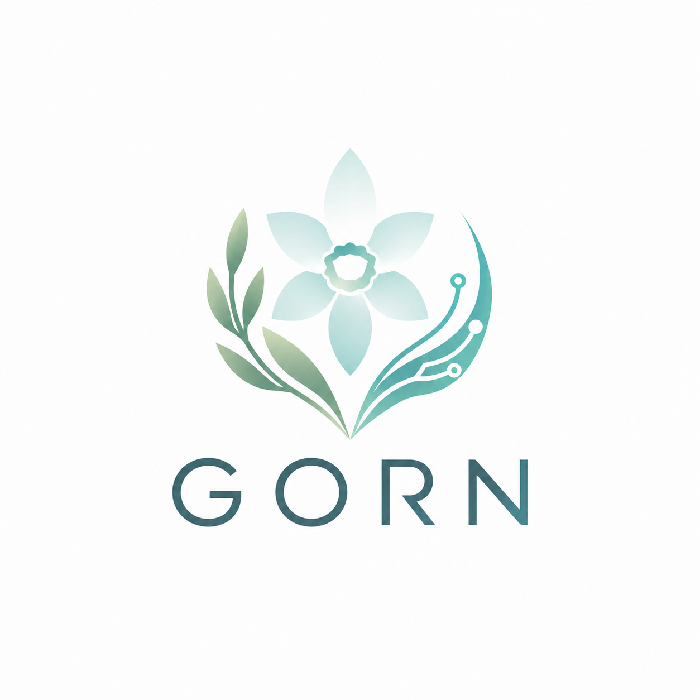

  

<h1 align="center">GORN</h1>

  <b>Build. Protect. Grow.</b>

## Hi there 👋
# GORN

### Build. Protect. Grow.

Hi, I'm Guilherme 👋  
I'm building my path towards Software Engineering and Cybersecurity.

## Currently learning
- C++
- Software Engineering fundamentals
- Git & GitHub
- Cybersecurity fundamentals

## Current project
### Security Terminal
A modular C++ terminal application built to practise and consolidate:
- authentication
- loops and conditional logic
- switch statements
- multi-file architecture
- header files
- shared programme state
- statistics and credit management

## Current focus
Building strong programming foundations before moving into more advanced C++ concepts.

---

**GORN — Build. Protect. Grow.**
