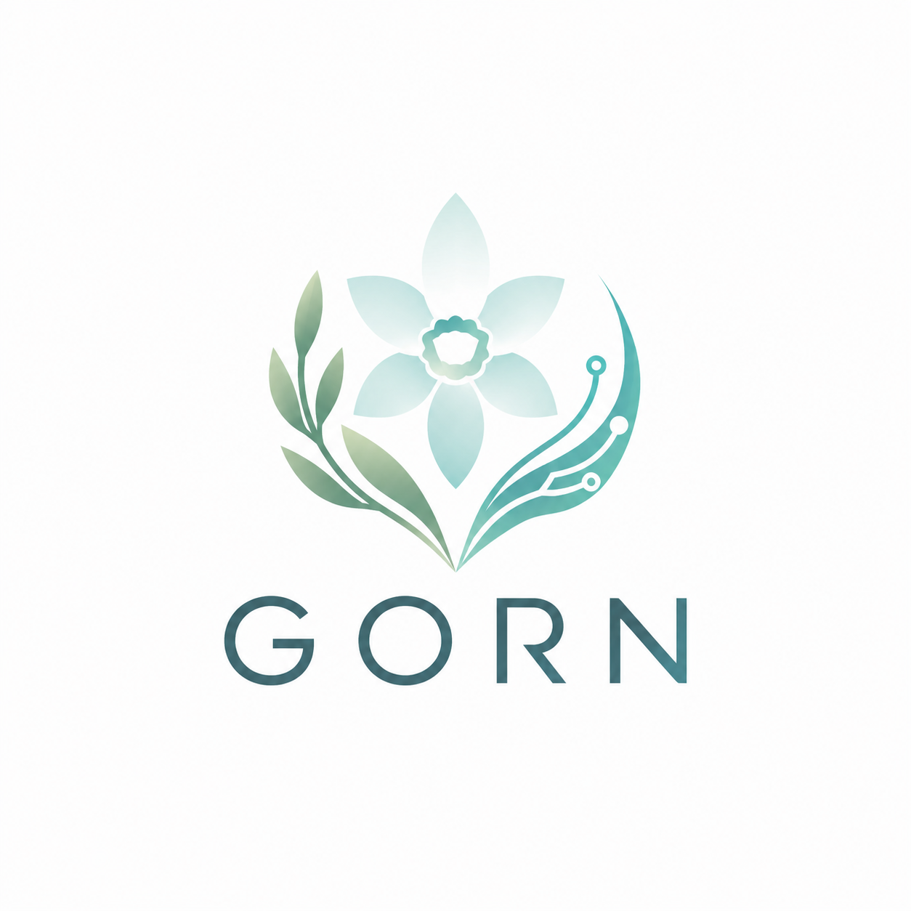

  

# Guilherme Randon

**C++ learning portfolio · Software engineering foundations · Cybersecurity interests**

I am building a foundation in software development through practical C++ projects. My work explores control flow, program state, modular design, and the process of turning small exercises into applications that are easier to understand and maintain.

## Explore my work

| Repository | Focus | Start here |
| --- | --- | --- |
| [C++ Learning Projects](https://github.com/randonguilherme15-beep/cpp-learning-projects) | Programming fundamentals, console games, planning tools, and file I/O | [Topic catalogue](https://github.com/randonguilherme15-beep/cpp-learning-projects#browse-by-topic) |
| [C++ Security Terminal](https://github.com/randonguilherme15-beep/cpp-security-terminal) | Multi-file architecture, shared state, menu navigation, and simulation | [Architecture and example](https://github.com/randonguilherme15-beep/cpp-security-terminal#architecture) |

## Learning priorities

- **Programming:** clear control flow, functions, collections, and object modelling.
- **Software design:** explicit responsibilities, state invariants, and maintainable interfaces.
- **Engineering practice:** reproducible builds, meaningful examples, version control, and accurate technical documentation.
- **Security foundations:** understanding the difference between a learning simulation and a system with verifiable security properties.

## How to read this portfolio

The repositories record an ongoing learning process. Documentation separates implemented behaviour, verified examples, known limitations, and future improvements. Original exercises are retained so progress remains visible.

I am currently strengthening my C++ foundations while developing my technical English and software engineering practice.

---

**GORN — Build. Protect. Grow.**
